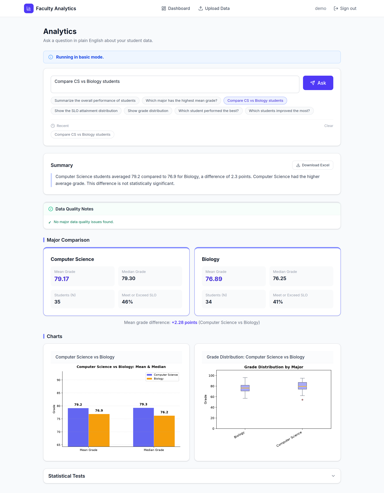
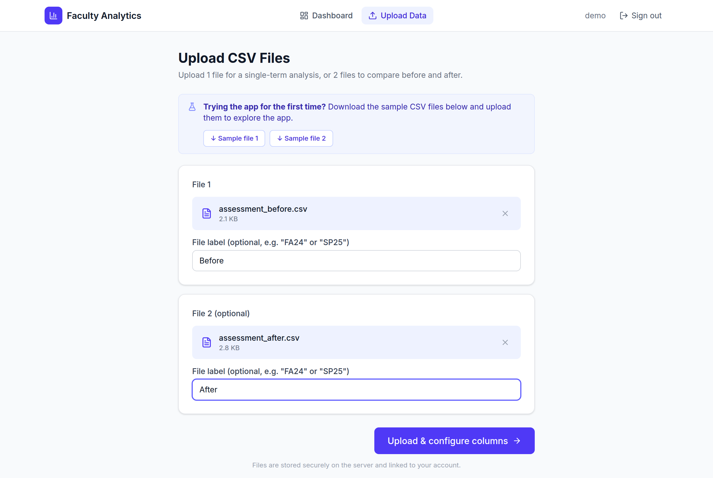
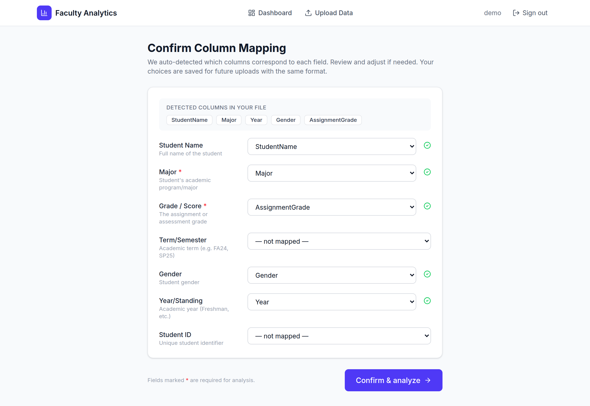
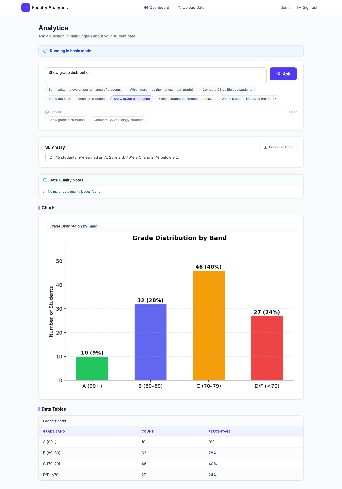
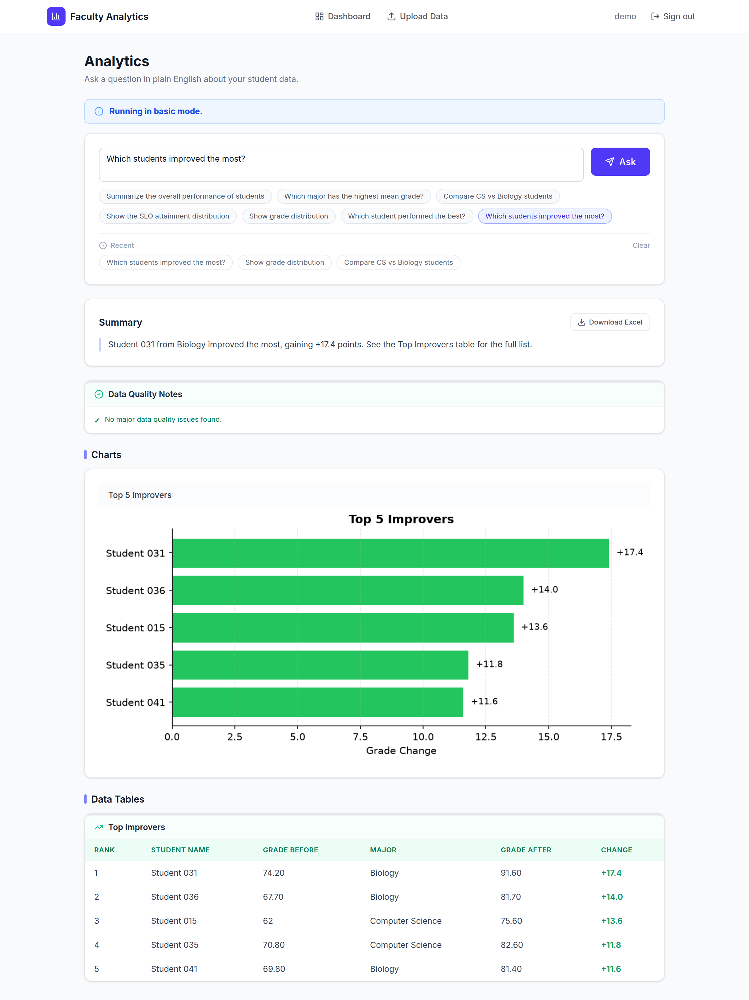
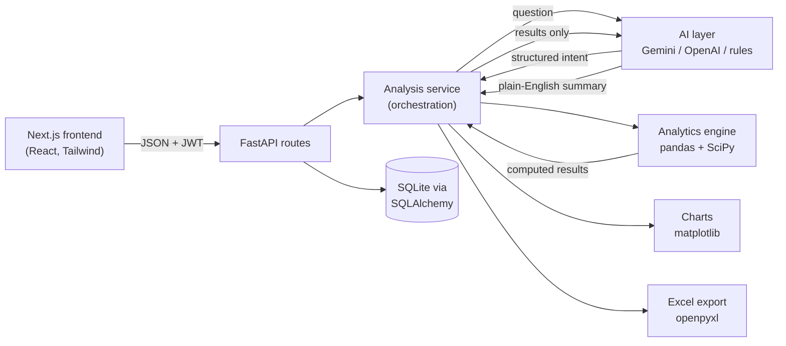

# Faculty Analytics

A full-stack web app that lets faculty upload student assessment CSVs and ask questions about them in plain English, such as *"Compare CS vs Biology students"* or *"Show the SLO attainment distribution"*. It answers with charts, tables, statistical tests, a plain-English summary, and a downloadable Excel report.



## Why it's built this way

**The LLM never computes a number.** Every statistic in the app (means, medians, SLO percentages, t-tests, ANOVA) is calculated in Python with pandas and SciPy. The language model only does two narrow jobs:

1. **Intent parsing:** turn a question into a structured JSON intent (for example `{"intent_type": "compare_majors", "compare_major_a": "Computer Science", ...}`).
2. **Summary writing:** turn the already-computed results into one to three plain-English sentences, with instructions not to invent figures.

This keeps the numbers auditable and reproducible, which matters when faculty use them for accreditation reporting. An LLM that does arithmetic can be confidently wrong; this design removes that failure mode.

**Three-tier fallback.** The AI provider is selected with `AI_PROVIDER` in `backend/.env`:

| Tier | Provider | Needs a key? |
|------|----------|--------------|
| 1 | Google Gemini (`gemini-3.5-flash-lite` by default, set with `GEMINI_MODEL`) | Yes |
| 2 | OpenAI (`gpt-4o-mini`) | Yes |
| 3 | Rule-based keyword parser and template summaries | No |

Every AI call is wrapped so that any failure (network error, exhausted quota, malformed JSON) falls through to the rule-based path. The app keeps working with no API key at all; it just understands a narrower range of phrasings. The UI shows which mode is active.

## Features

- **Upload one or two CSVs** (for example a "before" and "after" term) with optional term labels
- **Automatic column mapping:** detects which columns hold the student name, major, grade, term, and so on, lets you correct it, and remembers your choice for files with the same columns (matched by a fingerprint of the column names)
- **Natural-language questions** covering overall summaries, major rankings, major-vs-major comparisons, term comparisons, SLO attainment, grade bands, top and bottom students, and biggest improvers or declines between files
- **Statistics:** Welch's t-test (unequal variances) for two-group comparisons and one-way ANOVA across majors
- **SLO attainment levels:** Not Meet (< 70), Nearly Meet (70 to 79), Meet (80 to 89), Exceed (90+)
- **Data quality checks:** missing or out-of-range grades, missing or duplicate names, and majors with fewer than 5 students
- **Excel export:** a formatted workbook with a Report Summary sheet, embedded charts, and one sheet per result table
- **Accounts:** sign up and sign in with email or username; every file and mapping is scoped to its owner

## Screenshots

| Upload two terms | Confirm column mapping |
|---|---|
|  |  |

| Grade distribution | Top improvers across two terms |
|---|---|
|  |  |

## Architecture



A request flows **routes → services → engine**. Routes handle HTTP, auth, and ownership checks. The analysis service orchestrates one question end to end. The engine is pure pandas/SciPy code with no knowledge of HTTP or the database, so it can be tested and reused on its own.

```
DA app/
├── backend/
│   ├── app/
│   │   ├── main.py            # App setup, CORS, request logging, /health
│   │   ├── core/              # Settings, database session, password hashing and JWT
│   │   ├── models/            # SQLAlchemy tables: users, file_records, column_mappings
│   │   ├── schemas/           # Pydantic request and response models
│   │   ├── routes/            # /auth, /files, /mappings, /analysis
│   │   ├── services/          # Auth logic and analysis orchestration
│   │   ├── engine/            # Statistics, CSV loading, column mapping, AI layer, Excel export
│   │   └── utils/             # matplotlib chart builders
│   ├── requirements.txt
│   └── .env.example
├── frontend/
│   ├── app/                   # Pages: login, signup, dashboard, upload, mapping, analytics
│   ├── components/            # NavBar and small UI primitives
│   ├── lib/                   # API client, session helpers, shared types
│   ├── public/samples/        # Sample CSVs, downloadable from the upload page
│   └── .env.example
├── legacy/
│   └── student_assessment.py  # Original standalone script the engine was refactored from
└── docs/screenshots/
```

## Tech stack

| Layer | Tools |
|-------|-------|
| Frontend | Next.js 16 (App Router), React 19, TypeScript, Tailwind CSS 4, lucide-react |
| Backend | FastAPI, SQLAlchemy 2.0, Pydantic v2, Uvicorn |
| Analytics | pandas, NumPy, SciPy, matplotlib, openpyxl |
| AI | google-genai (Gemini), openai |
| Auth | bcrypt (passlib), JWT (python-jose, HS256) |
| Database | SQLite |

## Running it locally

**Prerequisites:** Python 3.11 or newer, Node.js 20 or newer.

### 1. Backend

```bash
cd backend
python -m venv .venv

# macOS / Linux
source .venv/bin/activate
# Windows (PowerShell)
.venv\Scripts\Activate.ps1

pip install -r requirements.txt
cp .env.example .env        # Windows: copy .env.example .env
```

Open `backend/.env` and set `SECRET_KEY` to a long random string. You can generate one with:

```bash
python -c "import secrets; print(secrets.token_urlsafe(48))"
```

Leave `AI_PROVIDER=basic` to run without any API key, or set it to `gemini` or `openai` and fill in the matching key.

```bash
uvicorn app.main:app --reload
```

The API runs at http://127.0.0.1:8000 and interactive docs are at http://127.0.0.1:8000/docs. The SQLite database and the `uploads/` and `outputs/` folders are created automatically on first start.

### 2. Frontend

In a second terminal:

```bash
cd frontend
npm install
cp .env.example .env.local  # Windows: copy .env.example .env.local
npm run dev
```

Open http://localhost:3000.

### 3. Try it with the sample data

1. Create an account.
2. Go to **Upload Data**. The page links to two sample files, `assessment_before.csv` (50 students) and `assessment_after.csv` (65 students). Upload both and label them "Before" and "After".
3. Confirm the detected column mapping.
4. Click any of the example questions on the Analytics page, or type your own.

The sample data is synthetic. The same 50 students appear in both files with the same major, year, and gender, so questions like "Which students improved the most?" or "Which students declined the most?" can match them by name. Gains vary by major and shrink for students who were already near the top, and a few students decline. The "after" file also has 15 students who only appear in that term, which shows how the app handles students without a match.

## Configuration

All backend settings are read from `backend/.env` (see `backend/.env.example`).

| Variable | Default | Purpose |
|----------|---------|---------|
| `SECRET_KEY` | placeholder | Signs JWTs. **Must** be changed for any real use. |
| `AI_PROVIDER` | `basic` | `basic`, `gemini`, or `openai` |
| `GEMINI_API_KEY` | empty | Needed when `AI_PROVIDER=gemini` |
| `GEMINI_MODEL` | `gemini-3.5-flash-lite` | Gemini model to call. Google retires models regularly, so it's configurable rather than hardcoded. |
| `OPENAI_API_KEY` | empty | Needed when `AI_PROVIDER=openai` |
| `DATABASE_URL` | `sqlite:///./faculty_analytics.db` | SQLAlchemy connection string |
| `UPLOADS_DIR` / `OUTPUTS_DIR` | `uploads` / `outputs` | Where CSVs and Excel exports are stored |
| `ACCESS_TOKEN_EXPIRE_MINUTES` | `480` | Session length (8 hours) |

The frontend has one setting, `NEXT_PUBLIC_API_URL` in `frontend/.env.local`, which points at the backend.

## API overview

All endpoints except signup, login, and health require a `Bearer` token.

| Method | Path | Purpose |
|--------|------|---------|
| POST | `/auth/signup` | Create an account, returns a JWT |
| POST | `/auth/login` | Sign in with email or username |
| GET | `/auth/me` | Current user |
| POST | `/files/upload` | Upload a CSV, returns detected columns |
| GET | `/files/list` | Your files, newest first |
| PATCH | `/files/{id}/term` | Set a file's term label |
| DELETE | `/files/{id}` | Delete a file |
| POST | `/mappings/suggest` | Auto-detect a column mapping |
| GET | `/mappings/saved/{fingerprint}` | Fetch a saved mapping |
| POST | `/mappings/save` | Save or update a mapping |
| POST | `/analysis/query` | Ask a question about 1 or 2 files |
| GET | `/analysis/export/{session_id}` | Download the Excel report |
| GET | `/health` | Status and active AI mode |

## Legacy script

`legacy/student_assessment.py` is the original single-file analysis script that this app grew out of. The web app's engine was refactored from it, and the SLO thresholds are kept identical. It still runs on its own against the sample data:

```bash
python legacy/student_assessment.py
```

Outputs go to `legacy/output/`.

## Known limitations

- **SQLite and local disk storage.** Fine for local use and demos. A hosted deployment would need a persistent database (such as Postgres) and durable file storage, since many free hosting tiers wipe the local disk on restart.
- **Rule-based mode is keyword matching.** Without an API key, phrasing outside the supported patterns falls back to a general summary, and some filters (such as "top 5 students in Biology") are not applied.
- **Session tokens live in `localStorage`.** Simple for a demo; an httpOnly cookie would be more robust against XSS in production.

## Author

**Shardul Pandit** · [GitHub](https://github.com/Shardul-Pandit) · [LinkedIn](https://www.linkedin.com/in/shardulpandit)
